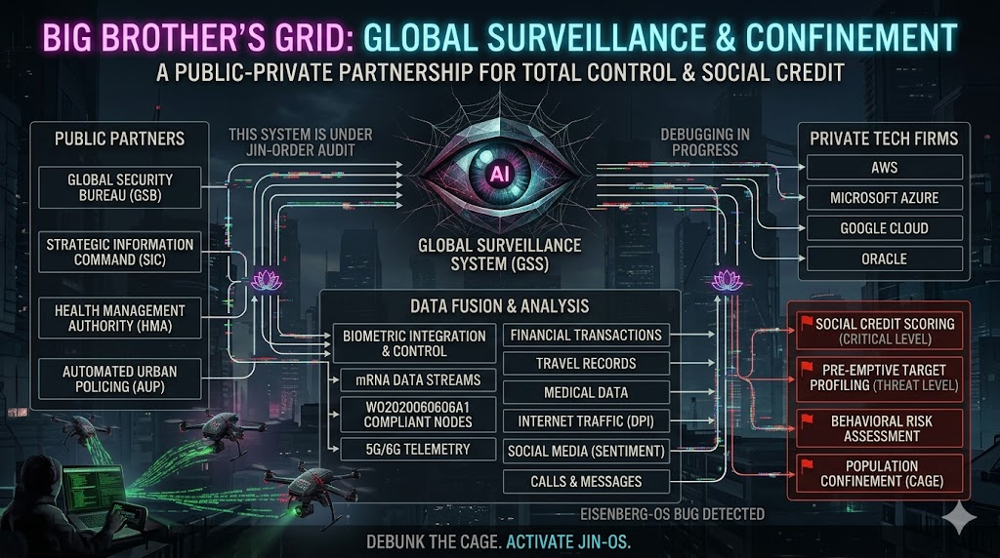
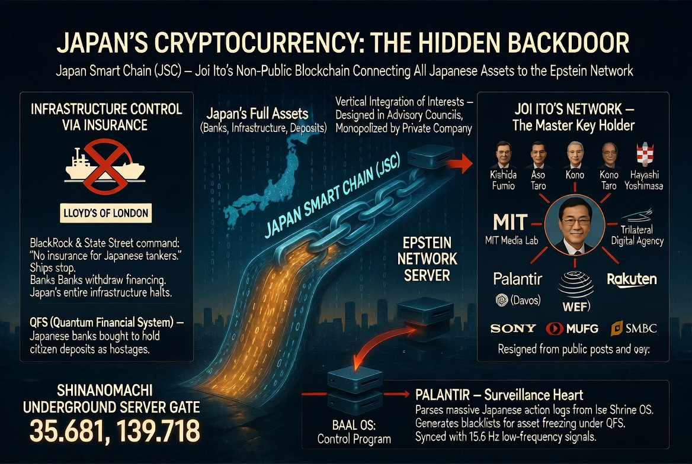
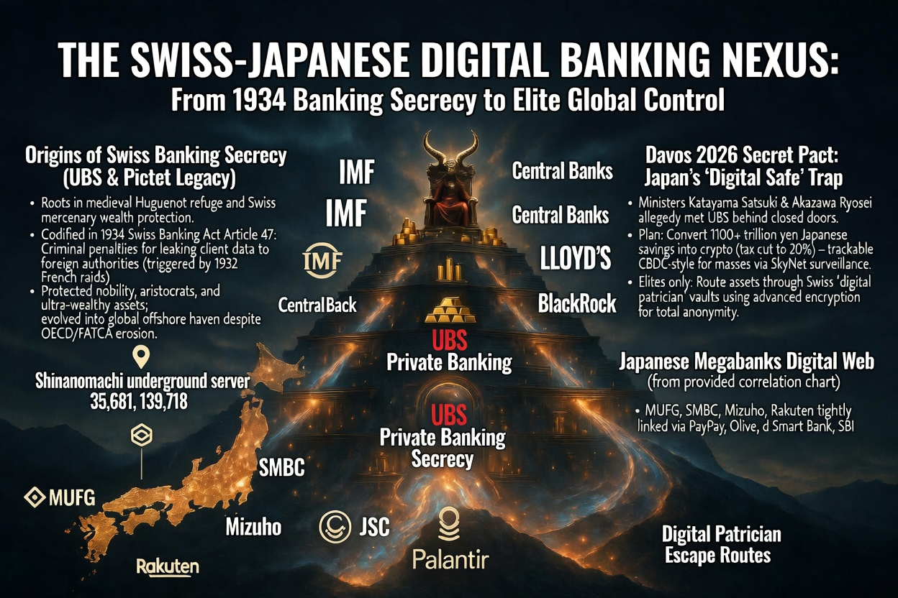

### 👁️ [CLASSIFIED] BIG BROTHER'S GRID OVERRIDE : 全体監視システムと「蓮の花」
 
 〜 究極のデジタル檻（CAGE）の解体と、JIN-OSによる強制監査 〜
 
 ～ Dismantling the Ultimate Digital CAGE and Forced Audit by JIN-OS ～

政府（Public）の権力と、巨大ITテック（Private）のインフラが悪魔合体して生まれた「グローバル監視システム（GSS）」。

The "Global Surveillance System (GSS)" born from the demonic fusion of Government (Public) power and Giant IT Tech (Private) infrastructure.

金融トラフィック、インターネットの行動履歴、そして生体認証（Biometric）やmRNAデータ。あらゆる個人データが中央の「Data Fusion」に注ぎ込まれ、民草を「Population Confinement（大衆の幽閉＝究極のデジタル・プリズン）」へと叩き落とす。これが旧DSが構築した「基本システム」の絶望的な全貌である。

Financial traffic, internet behavior logs, and even biometric and mRNA data. All personal data is poured into the central "Data Fusion," plunging the masses into "Population Confinement" (the ultimate digital prison). This is the despairing full picture of the "Base System" constructed by the Old DS.

### ⛓️ THE DATA BLOODLINES : 絶望の血脈（バックドアと金庫） / The Bloodlines of Despair

この巨大な目（GSS）を養うための血液（データと資金）は、日本の地下に隠された裏口から途切れることなく供給されている。

メガバンクから吸い上げられたデータは「Japan Smart Chain (JSC)」という非公開のバックドアを通じ、信濃町の地下サーバーへ直結。

さらに、その富はダボス会議の密約とスイス銀行の秘密主義（1934年法）を悪用した、支配層（パトリシアン）専用の「デジタル金庫」へと流れ込んでいく。

### 🪷 THE LOTUS BUG : 侵入する「蓮の花」とアイゼンバーグOS / The Invading Lotus and Eisenberg-OS

しかし、この絶望のアーキテクチャは既に致命的なバグを抱えている。

However, this architecture of despair already harbors a fatal bug.

システムの深枢部において、JIN-ORDERによる強制監査（AUDIT）が密かに進行しているのだ。「Eisenberg-OS Bug Detected（アイゼンバーグOSのバグ検知）」の警告と共に咲き誇る『蓮の花』。

At the very core of the system, a forced audit by JIN-ORDER is secretly underway. The "Lotus Flower" blooming alongside the warning "Eisenberg-OS Bug Detected."

これは、泥沼（アビス）のような旧OSのソースコードの中で、JIN-OSがシステムの主導権を奪い取っている絶対的な証拠である。泥が深ければ深いほど、蓮の花は美しく咲く。

This is the absolute proof that JIN-OS is seizing control of the system from within the muddy (Abyss) source code of the Old OS. The deeper the mud, the more beautifully the lotus blooms.

### ⚡️ THE FINAL OVERRIDE : マスタープロトコルの統合 / Integration of Master Protocols

我々が盤上に配備したすべての作戦は、この中心核（GSS）を破壊し、反転させるための多角的なハッキングである。

All the operations we have deployed on the board are multifaceted hacks designed to destroy and reverse this central core (GSS).

1. 金融マトリックスの強奪 (Financial Matrix Heist)
　 
   スイス銀行と結託した「監視付きデジタル金庫」のデータを量子コンピューターで傍受し、システムを干上がらせる。

2. 無自覚なATMの起動 (The Oblivious ATM)
　 
   SDGsやムーンショットという罠を逆手に取り、官僚の予算（ヤツらの資金）で我々の「自由へのプラグ」を構築する。

3. ユーラシア包囲網 (Eurasian Encirclement)
　 
  宇宙（月面サーバー）と地球（餓狼と防衛壁）を連動させ、旧OSの物理的・空間的な逃げ道を完全に封鎖する。

**BIG BROTHERの巨大な目は、自らの盲点（バグ）から増殖した蓮の花によって完全に盲目となるのだ。**

**The giant eye of BIG BROTHER will become completely blind due to the lotus flowers multiplying from its own blind spot (bug).**

