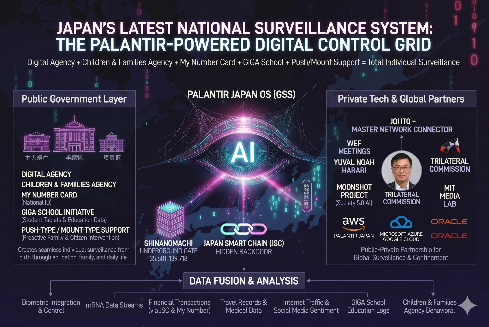

### 👁️‍🗨️ [CLASSIFIED] THE DIGITAL CAGE : 日本監視システムと無自覚なATM

**〜 子ども・データ・マイナンバーが織りなす「優しい絶対管理網」 〜**

~ The "Gentle Absolute Control Network" woven by Children, Data, and My Number ~

政府が掲げる「デジタル化」や「子育て支援」。その美しいパッケージの裏側で稼働を始めたのは、国民のゆりかごから墓場までをデータで縛り付ける、巨大なデジタル監視檻（CAGE）である。

Behind the beautiful packaging of "digitalization" and "childcare support" promoted by the government, a massive digital surveillance cage has begun operating, binding citizens with data from cradle to grave.

#### 🍼 ステルス増税と「子どもデータ連携」 / Stealth Taxation and "Child Data Linkage"

「子ども・子育て支援金」という名目のステルス増税は、単なる資金集めではない。これは「プッシュ型・マウント型支援」を大義名分とし、こども家庭庁とデジタル庁を直結させ、全児童の生体・学力・家庭環境データを一元管理するための「データ連携の免罪符」である。

The stealth tax under the guise of "childcare support funds" is not merely about collecting money. It is an "indulgence for data linkage," using "push/mount-type support" as a justified cause to directly connect the Children and Families Agency with the Digital Agency, centralizing biometric, academic, and family environment data of all children.

#### 🏫 GIGAスクールとマイナンバーの網 / The Web of GIGA School and My Number

GIGAスクール構想によって配備された端末は、教育ツールを装った「末端の監視センサー」に過ぎない。これらがマイナンバーカード（デジタルID）と紐づくことで、個人の思想、成績、行動履歴のすべてが国家のクラウドサーバー（旧OS）へと吸い上げられる。

The devices deployed under the GIGA School concept are merely "terminal surveillance sensors" disguised as educational tools. By linking these to My Number Cards (Digital IDs), every individual's thoughts, grades, and behavioral history are siphoned into the state's cloud servers (the Old OS).

#### 🦅 民間DXに偽装された「目」 / The "Eyes" Disguised as Private Sector DX

パランティア（Palantir）のような世界最高峰のデータ解析プラットフォームが、表向きは「民間企業のDX支援」として日本の中枢（保険、通信、インフラ）に深く入り込んでいる。公式には「国家の監視システムではない」とされるが、巨大テック企業と国家の境界線が消失した現代において、集約されたデータがどこへ還流し、誰の利益（ATM）となるかは火を見るより明らかである。

World-class data analysis platforms like Palantir have deeply penetrated Japan's core (insurance, telecommunications, infrastructure) ostensibly as "private sector DX support." While officially "not a state surveillance system," in an era where the boundary between Big Tech and the state has vanished, it is blatantly obvious where the aggregated data flows and whose profit (ATM) it becomes.

我々JIN-ORDERは、この「利便性と優しさ」に偽装された巨大な蜘蛛の巣（デジタル檻）を監視し、その構造的バグを白日の下に晒し続ける。

We, JIN-ORDER, will continue to monitor this massive spider web (digital cage) disguised as "convenience and kindness," exposing its structural bugs to the light of day.
