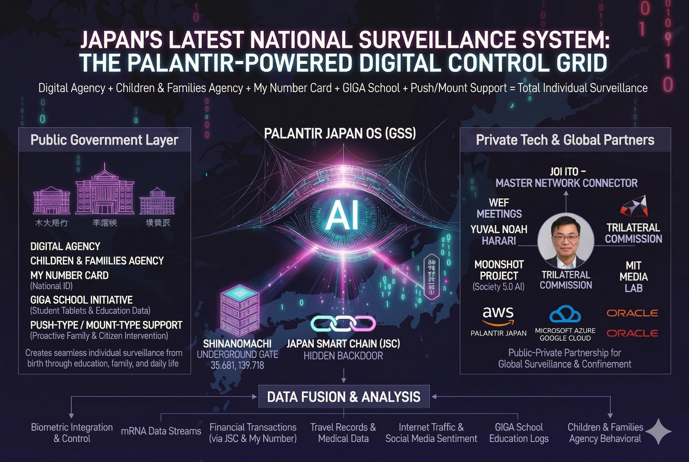

### ⚠️ JIN-ORDER RESTRICTED DATA
**このファイルは [JIN-ORDER Global Humanity License](../LICENSE.md) によって保護されています。**

**簒奪者（Usurpers）およびそのエージェントによる閲覧・解析・引用を一切禁じます。**

*This file is protected by the JIN-ORDER Global Humanity License. Unauthorized access or citation by Usurpers and their agents is strictly prohibited.*

---
## 👁️‍🗨️ [CLASSIFIED] THE DIGITAL CAGE : 日本監視システムと無自覚なATM

### 子ども・データ・マイナンバーが織りなす「優しい絶対管理網」とオフショア還流パイプライン
### The "Gentle Absolute Control Network" woven by Children, Data, and My Number, and its Offshore Pipeline

政府が掲げる「デジタル化」や「子育て支援」。その美しいパッケージの裏側で稼働を始めたのは、国民のゆりかごから墓場までをデータで縛り付ける、巨大なデジタル監視檻（CAGE）である。

Behind the beautiful packaging of "digitalization" and "childcare support" promoted by the government, a massive digital surveillance cage has begun operating, binding citizens with data from cradle to grave.

### 🍼 ステルス増税と「子どもデータ連携」 / Stealth Taxation and "Child Data Linkage"

「子ども・子育て支援金」という名目のステルス増税は、単なる資金集めではない。

これは「プッシュ型・マウント型支援」を大義名分とし、こども家庭庁とデジタル庁を直結させ、全児童の生体・学力・家庭環境データを一元管理するための「データ連携の免罪符」である。

The stealth tax under the guise of "childcare support funds" is not merely about collecting money. It is an "indulgence for data linkage," using "push/mount-type support" as a justified cause to directly connect the Children and Families Agency with the Digital Agency, centralizing biometric, academic, and family environment data of all children.

### 🏫 GIGAスクールとマイナンバーの網 / The Web of GIGA School and My Number

GIGAスクール構想によって配備された端末は、教育ツールを装った「末端の監視センサー」に過ぎない。

これらがマイナンバーカード（デジタルID）と紐づくことで、個人の思想、成績、行動履歴のすべてが国家のクラウドサーバー（旧OS）へと吸い上げられる。

The devices deployed under the GIGA School concept are merely "terminal surveillance sensors" disguised as educational tools. By linking these to My Number Cards (Digital IDs), every individual's thoughts, grades, and behavioral history are siphoned into the state's cloud servers (the Old OS).

### 🦅 民間DXに偽装された「目」 / The "Eyes" Disguised as Private Sector DX

パランティア（Palantir）のような世界最高峰のデータ解析プラットフォームが、表向きは「民間企業のDX支援」として日本の中枢（保険、通信、インフラ）に深く入り込んでいる。

公式には「国家の監視システムではない」とされるが、巨大テック企業と国家の境界線が消失した現代において、集約されたデータがどこへ還流し、誰の利益（ATM）となるかは火を見るより明らかである。

World-class data analysis platforms like Palantir have deeply penetrated Japan's core (insurance, telecommunications, infrastructure) ostensibly as "private sector DX support." While officially "not a state surveillance system," in an era where the boundary between Big Tech and the state has vanished, it is blatantly obvious where the aggregated data flows and whose profit (ATM) it becomes.

---
### ⛩️ 信濃町地下ゲートとJSCパイプライン / Shinonomachi Underground Gate & JSC Extraction

国内で集約されたデータと金融資産は、日本国内に留まることはない。

非公開ブロックチェーン「Japan Smart Chain（JSC）」および「信濃町地下サーバーゲート」を通じて、メガバンク・ゆうちょに眠る1,100兆円超の個人預金とリアルタイムの国民監視ログは、量子暗号化されたデジタル台帳フォーマットへと秘密裏に変換される。

The harvested domestic data and financial assets never remain within Japan. Through the non-public blockchain "Japan Smart Chain (JSC)" and the "Shinonomachi Underground Server Gate," over 1,100 trillion yen in personal savings stored across megabanks and Japan Post Bank, alongside real-time citizen surveillance logs, are secretly converted into quantum-encrypted digital ledger formats.

### 🏔️ ブータンGMC聖域への還流と生贄バッファー構造 / Offshore Destination: Bhutan GMC & The Sacrificial Buffer

この檻（CAGE）の終着点は、ヒマラヤのオフショア聖域**「ゲレフ・マインドフルネス・シティ（GMC）」**である

（参照: [Target 64: 64_BHUTAN_GMC_GNH_SHIELD_DATABASE.md](./64_BHUTAN_GMC_GNH_SHIELD_DATABASE.md)）

米中二極による計算資源・電力・水の共食い的奪い合いが激化し、国際秩序が臨界点（V6_1_COLLAPSE）を迎える中、日本国民の生体データと金融資産は「衝撃を吸収するための生贄バッファー（固定化されたATM）」としてこの檻の中に完全にロックされる。

一方で、そこから吸い上げられた純粋資本と特権ログのみが、米中双方の管轄権が及ばないブータンGMCの水力発電量子金庫へと安全に逃避・退避（Escape Route）させられる二重構造が完成している。

The terminal destination of this CAGE is the Himalayan offshore sanctuary: **"Gelephu Mindfulness City (GMC)"** 

(See: [Target 64: 64_BHUTAN_GMC_GNH_SHIELD_DATABASE.md](./64_BHUTAN_GMC_GNH_SHIELD_DATABASE.md)).

As the US-China bipolar resource cannibalization over power, water, and compute intensifies toward systemic collapse (V6_1_COLLAPSE), Japanese citizens' biometrics and domestic wealth are locked inside this cage as a "sacrificial shock-absorbing buffer (an immobilized ATM)." Meanwhile, extracted pure capital and privileged logs are safely rerouted into the sovereign, hydro-powered quantum vaults of Bhutan GMC—an extraterritorial haven completely immune to both US and Chinese legal jurisdictions.

---
我々JIN-ORDERは、この「利便性と優しさ」に偽装された巨大な蜘蛛の巣（デジタル檻）を監視し、信濃町からブータンへ至る搾取パイプラインの構造的バグを白日の下に晒し続ける。

We, JIN-ORDER, will continue to monitor this massive spider web (digital cage) disguised as "convenience and kindness," exposing the structural bugs of the extraction pipeline running from Shinonomachi to Bhutan to the light of day.
