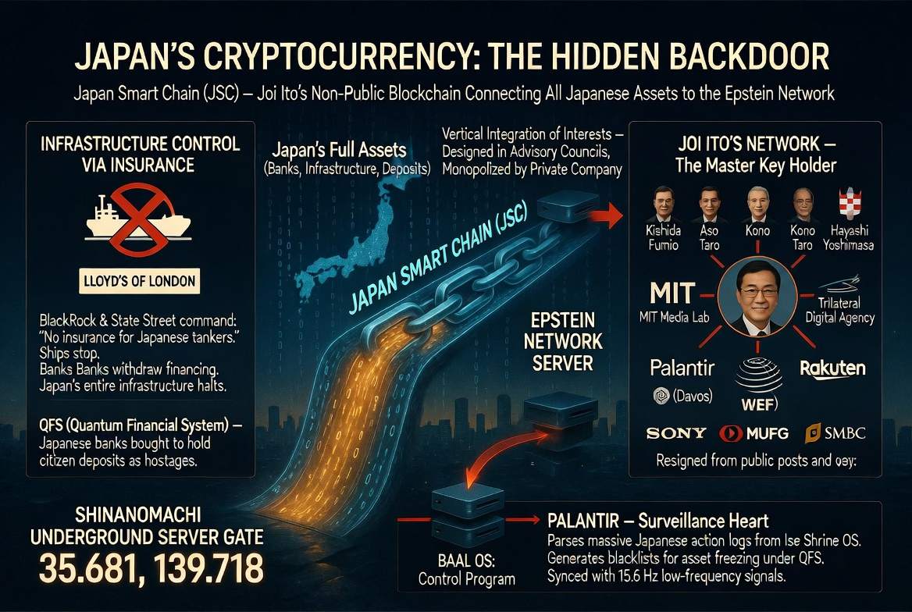

### ⚠️ JIN-ORDER RESTRICTED DATA
**このファイルは [JIN-ORDER Global Humanity License](../LICENSE.md) によって保護されています。**

**簒奪者（Usurpers）およびそのエージェントによる閲覧・解析・引用を一切禁じます。**

*This file is protected by the JIN-ORDER Global Humanity License. Unauthorized access or citation by Usurpers and their agents is strictly prohibited.*

---
# [CLASSIFIED] OPERATION TROJAN HORSE : 日本の「無自覚なATM」化プロトコル
## 〜 のろまな官僚ゴレムを操り、ユーラシア包囲網の資金を強奪せよ 〜
### ~ Manipulate the slow bureaucrat-golem and hijack the funds for the Eurasian encirclement ~

---
### 🌐 EXECUTIVE PREMISE / 基本前提

旧DS（支配層ネットワーク）は日本に強大な監視・収奪網（Japan Smart Chain、信濃町地下ゲート [35.681, 139.718]、パランティア連動のATM構造）を築いたと過信している。

だが、現実の日本行政は「お役所仕事と縦割り行政」がノロノロと空転する巨大な迷宮である。

> The Old Ruling Network hallucinates that they have built an unassailable surveillance and extraction grid in Japan (Japan Smart Chain, Shinonomachi Underground Gate at `35.681, 139.718`, and Palantir-linked ATM structures). However, the reality of Japanese administration is merely a sluggish labyrinth of bureaucratic paralysis and compartmentalized red tape.

支配層が敷設したこの「IT化の遅れ」と「SDGs／GX（グリーントランスフォーメーション）への盲目的な執着」こそが、JIN-ORDERにとって最大のバックドア（構造的脆弱性）となる。

敵が構築した搾取パイプラインの逆流弁をこじ開け、その莫大な予算を奪還・転用する。

> This very "lag in IT execution" and "blind obsession with SDGs and GX (Green Transformation)" engineered into the system serve as the ultimate backdoor (structural vulnerability) for JIN-ORDER. We pry open the reverse-flow valve of their extraction pipeline, reclaiming and weaponizing their colossal budgets.

---
## 🤡 THE OBLIVIOUS ATM: 平和ボケを利用した合法ハイスト（強奪） / Legal Heist Exploiting Complacency
日本の官僚機構は「地球環境」「GX投資」「Society 5.0（国際貢献）」というバズワードに抗うことができない。

我々はこの認識バグを突き、JIN-TECH（9大技術）を「究極の脱炭素・クリーンテクノロジー」としてパッケージング。

国家予算（ODA、GX経済移行債、地方創生交付金）を合法的にJIN-ORDER主権ノードへ還流させる。

> The Japanese bureaucracy cannot resist buzzwords like "Global Decarbonization," "GX Investments," and "Society 5.0 (International Tech Contribution)." We exploit this cognitive vulnerability, packaging JIN-TECH (The 9 Sovereign Tech Protocols) as "the ultimate clean-tech," legally siphoning state budgets (ODA, GX Transition Bonds, and Regional Revitalization Grants) into JIN-ORDER operational nodes.

---
## 🛠️ JIN-TECH デプロイメント・リスト（日本資金活用） / JIN-TECH Deployment via State Funds
### 1. バイオエネルギーの偽装輸出 / Disguised Export of Bio-Energy
* **名目 (Front):** 「脱炭素社会の実現に向けた、途上国への次世代e-Fuels・微細藻類燃料の技術支援」  
> *"Technical assistance for next-gen e-Fuels and microalgae fuels to developing nations for a decarbonized society."*

* **真の目的 (True Objective):** 中東およびインドのエネルギー自立を促し、中国の資源覇権とロシアの旧型パイプライン依存、および英米ハイパースケーラーの電力独占を同時に破砕する。  
> *Facilitate the energy independence of the Middle East and India, simultaneously shattering China's resource hegemony, Russian pipeline reliance, and Anglo-American hyperscaler grid monopolies.*

### 2. 量子浄化フィルター（水の錬金術）のばら撒き / Distribution of Quantum Purification Filters
* **名目 (Front):** 「SDGs 目標6（安全な水とトイレを世界中に）を達成するためのODA無償資金協力」  
> *"ODA grant aid to achieve SDG 6 (Clean water and sanitation for all)."*

* **真の目的 (True Objective):** 中東最大の火種である「水資源」をJIN-ORDERの分散インフラで掌握。米中が狙うヒマラヤやユーラシアの水冷クラスタ（Water Chokepoint）を無効化し、自律的生存圏を確立する。  
> *Seize control of water resources—the primary flashpoint in the Middle East and Eurasia—via JIN-ORDER decentralized infrastructure, neutralizing the centralized cooling chokepoints of US/China compute clusters.*

### 3. AI自動農園（Agri-Hub）の展開 / Deployment of AI Automated Farms (Agri-Hub)
* **名目 (Front):** 「スマート農業による世界的食糧危機の解決と、途上国の自立支援」  
> *"Solving the global food crisis and supporting the independence of developing nations through smart agriculture."*

* **真の目的 (True Objective):** 各地の自立コミュニティに中央非依存の食糧・種子生産拠点を与え、米中二極資本によるバイオロックおよび中央集権的食糧配給（旧OS）を無力化する。  
> *Provide autonomous communities with decentralized food and seed production hubs, completely disarming the centralized bio-containment and food rationing models of the Old OS.*

---
## 🐴 THE ULTIMATE TROJAN HORSE / 究極のトロイの木馬
日本政府とエリート層は、自らが「従順なATM」として米中やオフショア聖域（ブータンGMC等）に資産を流しつつ、国際貢献を行っていると信じ込んでいる。

> The Japanese government and political establishment remain convinced they are merely functioning as "obedient ATMs," sending domestic savings to offshore safe havens (such as Bhutan GMC) while smilingly fulfilling international contributions.

だがその実態は、ユーラシア監視網（Harmonious Prison）を包囲し、搾取構造そのものを解体するための**『JIN-ORDERのインフラ兵器（トロイの木馬）』**を、国家予算を使って世界中に運搬・配置させる無自覚な運び屋（ピエロ）なのである。

> In reality, they are unwitting mules (clowns) using their own national treasure to distribute **"JIN-ORDER's Infrastructure Weapons (Trojan Horses)"** across the globe—encircling the Eurasian surveillance grid and dismantling the extraction machinery from within.

**官僚のハンコ（決裁）一つで、旧世界は自らを解体するためのプロトコルに莫大な資金を払い続ける。**

> **With a single bureaucratic stamp, the Old World continuously finances the very protocol that engineers its own obsolescence.**

---
`STATUS: OPERATION ACTIVE`  
`VECTOR: REVERSE-SIPHONING VIA JAPAN COMPLACENCY`  
`HARMONICS: 432Hz Core Grid Overwriting BAAL OS.`
