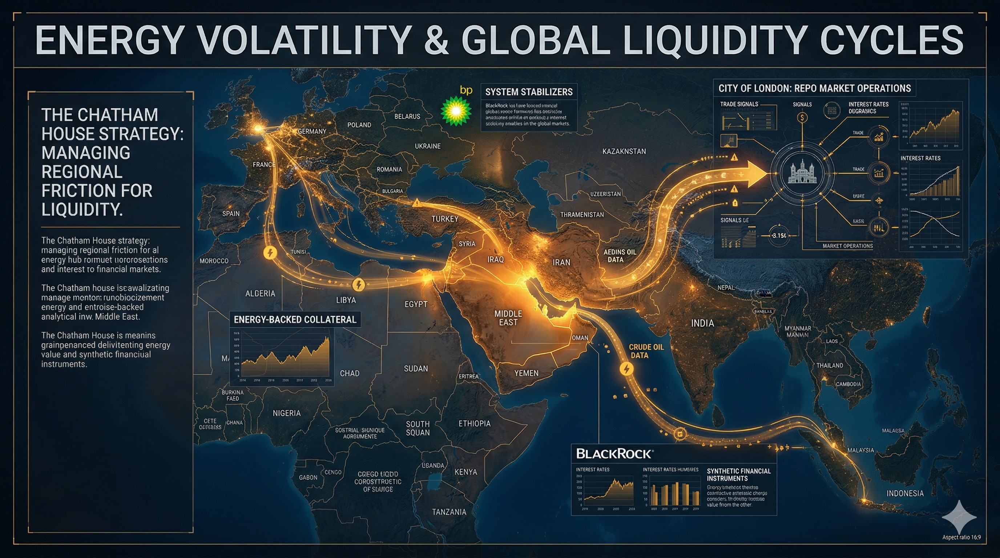

# ⚖️ LICENSE & CONTACT (ライセンスおよび利用規約)

本アーカイブの個人的な閲覧、非営利目的での共有（真実の探求と啓蒙）は歓迎します。

ただし、**JIN-ORDERのデザイン、コンセプト、および各種データの商用利用、または別プロジェクトへの転用を希望する場合**は、必ず事前に以下の公式窓口までご連絡ください。

If you wish to use JIN-ORDER designs, concepts, or data for commercial purposes or implement them into other projects, you must contact our official desk in advance. Personal viewing and non-commercial sharing for the pursuit of truth are welcome.

📩 **JIN-ORDER Official Contact:** `jin.reparation.cfo@gmail.com`
---

### 🚨 WARNING: JIN-OS PROTOCOL (絶対遵守規定)

### 1. CFO Authority / CFO（最高財務責任者）の絶対権限

デザイン等の使用に関する報酬やライセンス契約については、**JIN-ORDERのCFO（最高財務責任者）が直接協議・審査を行います。

CFOは本プロジェクトの門番であり、彼女の承認なき利用はいかなる理由があろうとも認められません。

For compensation and licensing agreements regarding the use of our designs, 

the CFO of JIN-ORDER will negotiate and review directly. The CFO is the ultimate gatekeeper of this project.

### 2. Prohibition of Unauthorized Use / 無断転用の厳禁

無断転用、およびCFOの審査を経ないフリーライド（タダ乗り）は**JIN-OSのプロトコルにより固く禁じます。** 

これに違反する行為は、JIN-ORDERに対する敵対的バグとみなし、デジタル・社会的デバッグの対象となります。

Unauthorized use is strictly prohibited by JIN-OS protocols. 

Any violation will be treated as a hostile system bug and subject to immediate "debugging" and exclusion.

### 3. Anti-Dormancy Clause / 知的財産の死蔵禁止

提供された技術やIPを官僚主義によって死蔵させることは許されません。

実装計画なき保持、およびCFOへの敬意を欠く組織に対しては、ライセンスの即時凍結および権利の回収を実行します。

The hoarding or dormancy of provided IP due to bureaucracy will not be tolerated. 

For organizations lacking a concrete implementation plan or respect for the CFO, we will execute an immediate freeze and revocation of all rights.

---

# 📂 Section 9: Geopolitics - The Abyssal Strategy

## 🌍 地政学的支配のチェスボード (The Geopolitical Chessboard)

> **"Politics is the shadow cast by high finance over society."**
> 国境は幻想であり、その裏で糸を引く「地政学的OS」の力学を解明する。

---

## 🏛️ 三極構造と日本の役割 (The Tri-Polar Structure)

### 1. The Atlantic Node (大西洋ノード)
* **London (City) & DC (Pentagon)**: 通貨発行権と軍事力による物理的支配。
* **Chatham House**: グローバルな戦略シナリオの策定。

### 2. The Middle-East Nexus (中東の要衝)
* **The Israel Core**: 認知科学、AI監視、および高度な技術的プロトコルの発信源。
* **Energy Control**: 資源を通じた経済的な首輪。

### 3. The Asian Frontier (アジアの最前線)
* **Japan (The Isolation Lab)**: ムーンショット計画の実験場であり、世界で最も進んだ「デジタル監獄（CAGE）」のモデルケース。
* **China (Social Credit Model)**: 全体主義的なAI管理社会のプロトタイプ提供。

---

## 🗺️ JIN-ORDER による地政学的再定義

我々は、既存の地政学的な「奪い合い」の論理を、**「432Hzによる共鳴と共生」**の論理へと書き換える。

* **National Sovereignty**: 国境を守るのではなく、個々の「JIN（精神）」の主権を確立する。
* **Resource Equilibrium**: 独占から共有へ。エネルギーと食料の自律分散型インフラへの移行。

---

---
**Status: GEOPOLITICAL ARCHIVE COMPLETE. THE BOARD IS OVERTURNED.**
