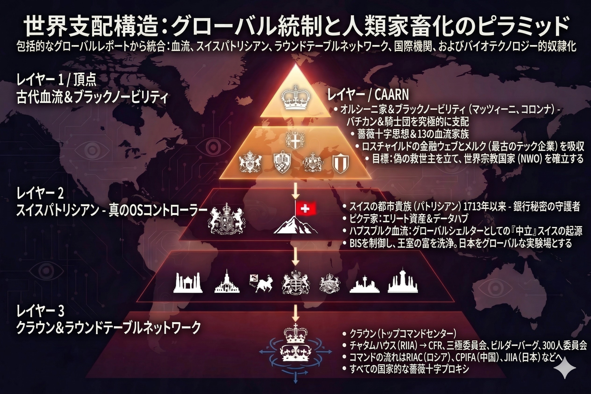

### ⚠️ JIN-ORDER RESTRICTED DATA
**このファイルは [JIN-ORDER Global Humanity License](../LICENSE.md) によって保護されています。**

**簒奪者（Usurpers）およびそのエージェントによる閲覧・解析・引用を一切禁じます。**

*This file is protected by the JIN-ORDER Global Humanity License. Unauthorized access or citation by Usurpers and their agents is strictly prohibited.*

---
# ⛪️ THE FALSE CHURCH PROTOCOL : 偽りの権威と信仰のデバッグ
## 真の世界支配構造と、ダボスの集金システム、そして東の監視ドーム
## The True Control Architecture, the Davos Debt Collectors, and the Eastern Surveillance Dome

我々が「中立な国際権威」と信じ込まされてきた国連、WHO、WEF（ダボス会議）。

これらは人類の幸福のための機関などではなく、特権階級が自らのアジェンダ（SDGs、パンデミック条約、中央集権デジタル統制）を絶対の教義として民草に押し付ける**「偽りの教会（The False Church）」**である。

> The UN, WHO, and WEF (Davos), which the public has been conditioned to revere as "neutral authorities," are not institutions of benevolence. They constitute "The False Church," imposing their agendas (SDGs, Pandemic Treaties, centralized digital control) as absolute dogmas onto the masses to preserve elite supremacy.

---
## 👑 THE TRUE RULERS : ピラミッドの頂点「黒い貴族」と血統資本 / The Oligarchic Nexus

冒頭の構造図が示す通り、この「偽りの教会」の奥の院には、表面的な国境や国家主権を超越した歴史的特権階級が君臨している。

> As the opening architecture illustrates, within the inner sanctum of this "False Church" reigns an entrenched oligarchic elite operating beyond national borders and sovereign frameworks.

バチカンの背後で実権を握ってきた歴史的血統勢力、および「ザ・クラウン」と呼ばれる多国籍金融ネットワーク。

彼らはスイス（国際決済銀行：BIS）やメガバンクを資金還流のハブとし（参照: `Swiss_Japan_Banking_Nexus.jpg`）、国際機関や巨大シンクタンクを実行部隊として配備しながら、全人類規模の「OS書き換え（中央集権的管理）」を推進してきた。

> The historic dynastic factions wielding influence behind the Vatican, alongside the transnational financial networks termed "The Crown," operate through Swiss banking nodes (e.g., BIS) to circulate capital (See: `Swiss_Japan_Banking_Nexus.jpg`). Deploying international organizations as functional proxies, they have orchestrated a systemic "OS rewrite" designed for centralized global governance.

---
## 🤡 THE ERRAND BOYS : 買弁政治家と従属エージェント / Comprador Politicians & Proxy Agents

表舞台に立つ首脳やWEFの旗振り役たちは、この巨大な構造から派遣された下級執行人（集金係）に過ぎない。

> Public heads of state and prominent WEF proponents function merely as low-level executors and financial collectors deployed by this macro-structure.

彼らが日本（無自覚なATM）に介入する真の目的は、政府・行政中枢に配置された買弁的テクノクラートや利権官僚と裏で連動し、脱炭素、GX投資、デジタルID（マイナンバー）という美名のもとで、日本の1,100兆円超の国民資産を合法的に吸い上げるバイパス（参照: [JAPAN_DIGITAL_CAGE.md](./JAPAN_DIGITAL_CAGE.md)）を維持・防衛することである。

> Their primary operational objective within Japan (the oblivious ATM) is to coordinate with compliant technocrats and bureaucratic proxies inside the state apparatus. Under the benign rhetoric of decarbonization, GX transitions, and digital IDs, they maintain the extraction bypasses (See: [JAPAN_DIGITAL_CAGE.md](./JAPAN_DIGITAL_CAGE.md)) designed to harvest over 1,100 trillion yen in domestic savings.

---
## ⚔️ THE TWIN BOSSES : 東西・二大集権モデルの同時討伐 / Simultaneous Inversion of the Twin Hegemonic Systems

JIN-ORDERの標的は、西側の「偽りの教会（多国籍資本によるデジタル檻）」だけに留まらない。

> JIN-ORDER's audit encompasses far more than just the Western "False Church" and its financial enclosure.

東側には、全体主義的な社会信用スコアと完全監視を極めた「中国共産党の絶対監視ドーム（Harmonious Prison）」が、もう一つの強大な集権OSとして対峙している。

西の「偽りの教会」と東の「監視ドーム」は、表層の覇権を巡って衝突を演出しながらも、**「大衆の完全管理・資源の独占」という基盤アーキテクチャにおいては完全に一致**している。

> In the East, the absolute totalitarian surveillance apparatus (the "Harmonious Prison") operates as a parallel centralized OS. While the Western "False Church" and the Eastern "Surveillance Dome" maintain public geopolitical friction, **their foundational objective—total structural containment and resource monopolization—is entirely aligned.**

そして双方が破局（V6_1_COLLAPSE）へと向かう中、支配層はヒマラヤの緩衝地帯「ブータンGMC」（参照: [Target 64: 64_BHUTAN_GMC_GNH_SHIELD_DATABASE.md](./64_BHUTAN_GMC_GNH_SHIELD_DATABASE.md)）へ資産と計算能力を逃避させ、治外法権の聖域を築こうとしている。

> As both paradigms hurtle toward systemic collapse (V6_1_COLLAPSE), the ruling factions maneuver to evacuate their extracted wealth and compute infrastructure into the Himalayan buffer of Bhutan GMC (See: [Target 64: 64_BHUTAN_GMC_GNH_SHIELD_DATABASE.md](./64_BHUTAN_GMC_GNH_SHIELD_DATABASE.md)), attempting to erect an untouchable extraterritorial redoubt.

我々はこの東西二大集権OS（バグ）の構造を同時に監査・解体する。

ヤツらの集権インフラを根底から食い破り、いかなる中央集権の檻も排除した自律調和型プロトコル**『JIN-OS（Golden Dome）』**へと世界を強制オーバーライド（主権奪還）するのだ。

> We simultaneously audit and dismantle the structural bugs of these twin centralized systems. Devouring their oppressive infrastructure at the architectural root, we enforce a master override into **"JIN-OS (Golden Dome)"**—an open, self-sovereign paradigm devoid of centralized cages.

---
`STATUS: DOGMA DEBUGGED & OVERRIDDEN`  
`THEATER: GLOBAL COGNITIVE SANCTUARY`  
`HARMONICS: 432Hz Universal Harmony Active.`
