### ⚠️ JIN-ORDER RESTRICTED DATA

**このファイルは [JIN-ORDER Global Humanity License](https://github.com/JIN-ORDER-OFFICIAL/GOVERNANCE_OF_ABYSS/blob/main/LICENSE.md) によって保護されています。**

**無断転用、受託コンサルタントによる仕様書ロンダリング、机上の空論による改ざんを固く禁じます。**

---

## JIN-ORDER SPECIFICATION // LEVEL-0 INTEGRATED HABITAT & ECOLOGICAL DEFENSE
**DOC-ID:** JIN-SPEC-2026-003  
**TITLE:** 自律分散型水循環・土壌生態及び生命維持居住圏統合仕様（オアシス・サーキュラープロトコル）  
**SUB-TITLE:** "Nobody Thirsts, Nobody Starves" 閉鎖循環型生活インフラ・生態系再生工学基準  
**ISSUER:** 一般社団法人JIN-ORDER（UN Partner Portal ID: 64636）  
**MISSION:** "Nobody Cries"（誰も泣かない世界）  
**ARCHITECTS:** Masano Takashi（Founder & Chief Architect） / Masano Miyo（Co-Founder & Director）  
**STATUS:** ACTIVE / CORE SPECIFICATION  

---

## 1. 概要（Executive Summary）

本仕様書は、外部補給線が100%遮断された紛争被災地、乾燥半乾燥地帯、鉱山開発跡地、および地下深淵区画において、人類の尊厳ある生存を自律維持するための「水循環・建材土木・土壌生態・バイオマスエネルギー・人道主権」を一体化した総合工学仕様を定義する。

旧世代の統治機構において、水資源、肥料、建築資材、および必須鉱物は中央集権資本による独占と搾取の道具（兵糧攻め・債務奴隷のレバレッジ）として機能してきた。<br>
JIN-ORDERは、現地の砂・水・有機廃棄物・太陽光を即座に高付加価値インフラへと変換し、完全閉鎖循環型の自立生存圏（Sanctuary Life Cell）を確立する。

---

## 2. 脅威モデル（Threat Model）

| 脅威レベル | 攻撃・事象ベクトル | 対象インフラ | 従来型OSの脆弱性 | JIN-ORDERの防衛応答 |
| :--- | :--- | :--- | :--- | :--- |
| **THREAT-A** | 水源遮断・渇水兵糧攻め | 河川上流ダム、広域水道網、取水口 | 給水停止による降伏・集落崩壊 | 量子水濾過パビリオン & 自律灌漑網 |
| **THREAT-B** | 物資兵糧攻め・建材供給遮断 | セメント、鉄筋、プレハブ資材網 | 避難所の建設不能・凍死・スラム化 | 砂漠砂・鉱物尾鉱の現地CSEB/3D成形 |
| **THREAT-C** | 表流水・地下水系の毒化汚染 | 井戸、地下帯水層、農業用水路 | 広域生化学汚染による集団罹患 | ナノ多孔膜・量子ドット分子励起分解 |
| **THREAT-D** | 肥料独占・種子隷属化 | 輸入化学肥料、遺伝子組み換え種子 | 土壌疲弊、価格高騰による飢餓 | 不溶性リン解放菌根菌 & 種子ヴォルト |
| **THREAT-E** | 資源の呪い・児童強制労働 | コバルト等の重要鉱物採掘地 | 暴力支配、健康破壊、極限搾取 | バイオ浸出・シスターフッド協同組合 |

---

## 3. 3層統合生活基盤アーキテクチャ（Three-Tier Life-Infrastructure Architecture）

```text
[Layer 2: Benevolent Commons Kernel]
   ├─➡️「Nobody Thirsts / Nobody Starves」（生命維持水・食糧無条件配分）
   ├─➡️ シスターフッド・アライアンス（母性主権・児童労働ゼロ・公正取引）
   └─➡️ 六聖叡智教育法（学びの完全解放・先端技術の郷土還元
   │
[Layer 1: Autonomous Hydromesh & Bio-Loop]
   ├─➡️ MABR（無気泡中空糸膜）超省エネ水処理 & AI嫌気性消化
   ├─➡️ 汚泥細胞破壊 ──▶ 100%自家熱電併給 & e-Fuel/都市ガス合成
   ├─➡️ 閉ループ・コバルト・バイオ浸出マイクロプラント（ゼロエミッション）
   └─➡️ 太陽光ハイブリッド飛行船 & 自動運転EV・IoTホログラム遠隔灌漑
   │
[Layer 0: Subterranean Matrix & Hardened Ground]
   ├─➡️ 量子浄化フィルター（カナート・河川水系分子レベル無害化 1L/s）
   ├─➡️ 再生生態盆地（重力式階段曝気 & 多孔質貫石材堰・人工保水湿地）
   ├─➡️ 砂漠砂・尾鉱現地精製（CSEBブロック成形 >45N/mm² & 自律3Dプリント建築）
   └─➡️ 肥料シールド（アーバスキュラー菌根菌・不溶性リン解放・種子ヴォルト）
```
---

### 3.1 Layer 0: 物理水・土木・生態基盤層（Subterranean Matrix & Hardened Ground）
外部からの物資供給ゼロで生活空間と水系を構築する土木・材料基盤。

### 1. 量子浄化フィルター配備（極限分子水浄化）
* グラフェン層とセラミック層によるマルチレイヤーナノ多孔膜回路と量子ドット配列を実装する。
* 汚染物質を電子励起により瞬時に純酸素と安全な水へ変換する（浄化速度1L/sec、PM2.5 99.99%除去）。
* 地下カナート（伝統地下水路）や河川流路に直接モジュールを配置し、純度99.998%の最適ミネラル水を自律供給する。

  
*図3.1-A: マルチレイヤーナノ多孔膜と量子ドット配列によるリアルタイム汚染物質変換システム（運用技術者：ポン）*

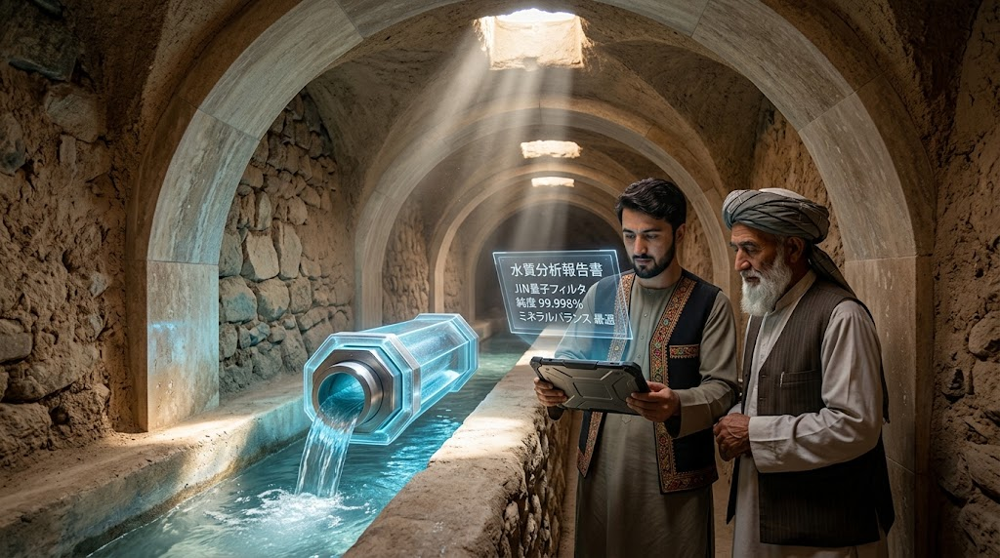  
*図3.1-B: 伝統カナート水路への量子フィルター設置と純度99.998%リアルタイム水質分析*

### 2. 再生生態盆地（Regenerative Ecological Basin）
* コンクリート護岸を用いず、多孔質貫石材堰と重力式階段曝気チャネルによって自然流下曝気を実施する。
* 人工保水湿地と葦原を造成し、乾燥半乾燥地帯を湿気と生命のあふれる湖沼へと復元する。
* 山岳地下水系から引き込んだ水路により、砂漠の段々畑とオアシス集落を一体再生する。

  
*図3.1-C: 重力式階段曝気チャネルと多孔質貫石材堰による自然流下式水質再生盆地*

  
*図3.1-D: 量子水濾過パビリオンを中心とした再生オアシス谷と農地復興*

### 3. 砂漠砂移動式精製プラント ＆ 鉱物尾鉱3Dプリント建築
* 現地の飛砂をコンテナ型プラントに投入し、高速微粉砕機（ハンマーミル）とポリマー結合結晶化チャンバーを経て、高強度インターロッキングCSEBブロック（圧縮強度>45 N/mm²、生産量500ブロック/h）を油圧成形する。
* 鉱山開発跡地では、再生鉱物尾鉱骨材と自律アーム型／ガントリー型3Dプリンターを連動させ、人道支援シェルター、学校、病院、および防護土留め擁壁を即座に自動積層する。

  
*図3.1-E: 太陽光駆動・砂漠砂移動式精製プラントとCSEB油圧圧縮プレスの現場配備*

  
*図3.1-F: 移動式コンテナ内におけるハンマーミル粉砕・ポリマー結晶化・CSEBブロック自動成形プロセス*

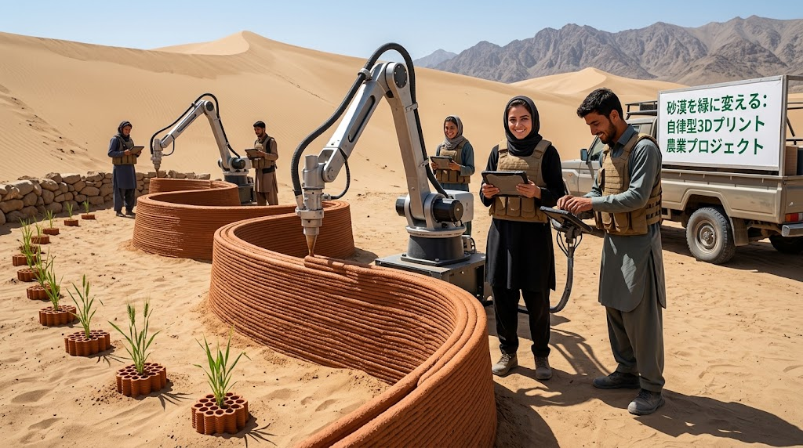  
*図3.1-G: 砂漠を緑に変える自律型アームロボット3Dプリントによる防砂擁壁と灌漑区画の自動施工*

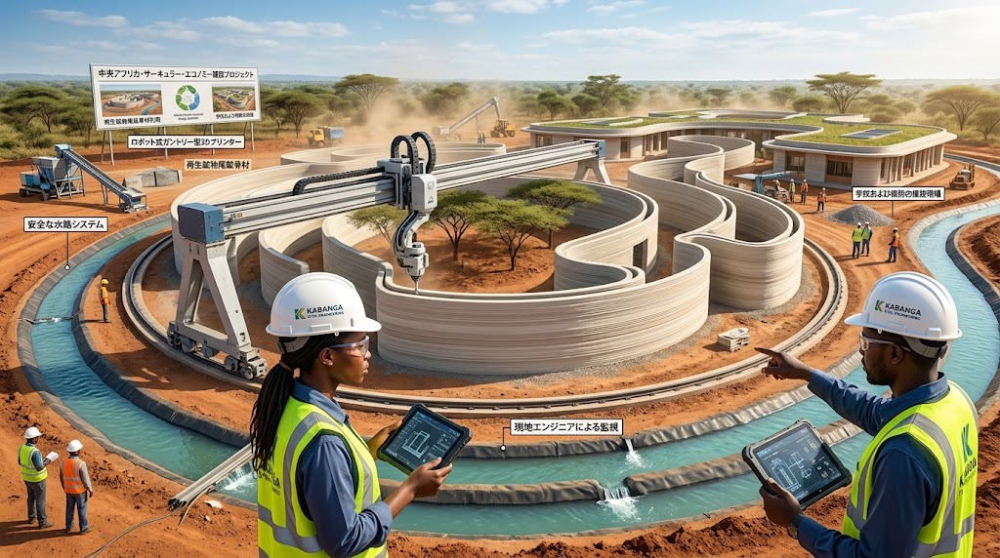  
*図3.1-H: 鉱物尾鉱骨材とロボット式ガントリー型3Dプリンターによる学校および病院の自動建設*

### 4. 肥料シールド ＆ アーバスキュラー菌根菌ネットワーク
* 多孔質バイオ炭容器と有機酸ボカシを用い、土壌中のアルミニウム結合不溶性リンを生物利用可能なリン酸イオンへ解放する。
* マイナス20℃に保たれた地下「種子コモンズ・ヴォルト」にて在来種・非遺伝子組み換え種子を永久保全し、輸入肥料ゼロでの食糧安全保障を確立する。

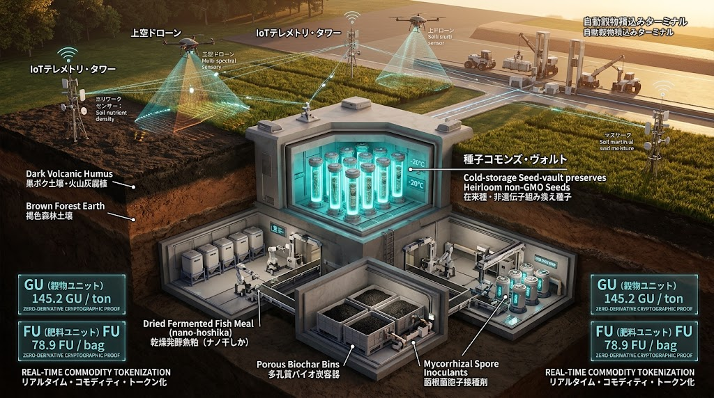  
*図3.1-I: 地下種子コモンズ・ヴォルト、IoTテレメトリ・タワー、および多孔質バイオ炭容器群*

  
*図3.1-J: アーバスキュラー菌根菌ネットワークによる土壌不溶性リン解放メカニズムと自動種子銀行監査*

---

### 3.2 Layer 1: 自律水理・バイオエネルギー制御層（Autonomous Hydromesh & Bio-Loop）
都市・生活圏内の代謝副産物を100%エネルギーと資源へ変換する閉鎖循環層。

### 1. MABR（無気泡膜バイオフィルム反応器）超省エネ水処理
* 中空糸膜の内腔から純空気を送り、気泡を作らず膜壁を通して酸素を吸収率ほぼ100%で微生物バイオフィルムへ供給する（ブロワー動力を50%以上節約）。
* 施設電力を太陽光と蓄電設備で賄う完全エネルギー自律型循環水施設を構築する。

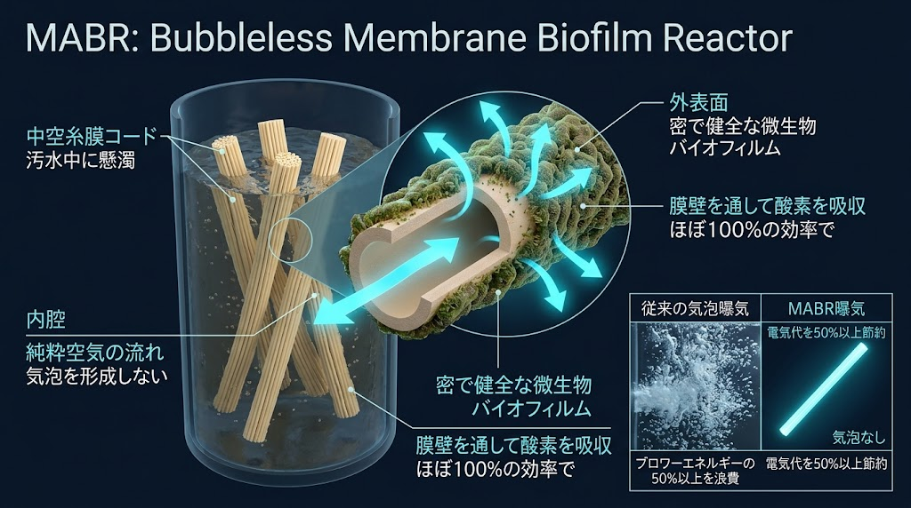  
*図3.2-A: MABR（Bubbleless Membrane Biofilm Reactor）の中空糸膜構造と高効率酸素供給モデル*

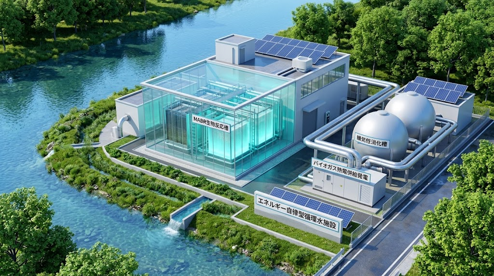  
*図3.2-B: MABR生物反応槽、嫌気性消化槽、およびバイオガス熱電併給発電設備の外観*

### 2. 汚泥細胞破壊 ＆ 自律型バイオガス発電・e-Fuel合成
* 発生汚泥を電気動脈と熱温圧圧で細胞破壊して結合水を放出させ、極限脱水と自己燃焼能力を確保する。
* AI高温嫌気性消化槽によりバイオガスを従来の1.5倍高速生成し、コージェネレーション発電でプラント全電力・熱を100%供給する。
* 余剰メタンはサバティエ合成ユニットで合成燃料（e-Fuel）および都市ガス網へ直結する。

  
*図3.2-C: 汚泥細胞破壊脱水からAI嫌気性消化、コージェネレーション発電、e-Fuel直結サバティエ合成フロー*

### 3. 閉ループ・コバルト・バイオ浸出マイクロプラント
* 太陽光駆動のバイオリアクター（発光培養空洞）を用い、常温・極低環境負荷の微生物反応でレアメタルを抽出する。
* 有害酸性廃液や精錬排ガスを外部へ一切排出しないゼロエミッション閉ループを維持する。

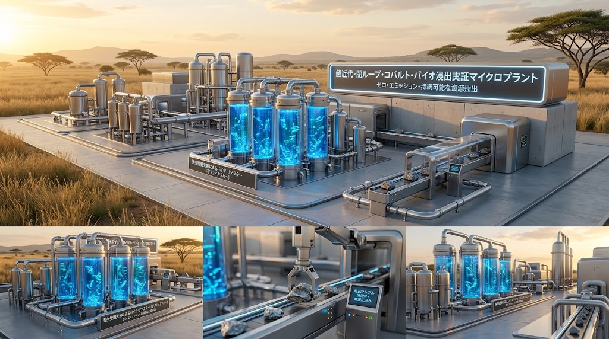  
*図3.2-D: 発光培養空洞バイオリアクターによるゼロエミッション・コバルトバイオ浸出システム*

### 4. 太陽光ハイブリッド飛行船 ＆ スマート灌漑テレメトリ
* 上面にソーラーパネルを敷設したハイブリッド飛行船が、地上の悪路に依存しない空中補給・長距離移動ラインを形成する。
* 地上ではIoTテレメトリ・タワーと土壌水分センサーが連動し、太陽光自律ポンプとホログラム診断端末による最適点滴灌漑を実行する。
* 高地・森林部においては自動化環境ドームと自律電気輸送車によるリープフロッグ型流通を展開する。

  
*図3.2-E: サヘル地域上空を航行する太陽光飛行船と地上オアシス再生導水インフラ*

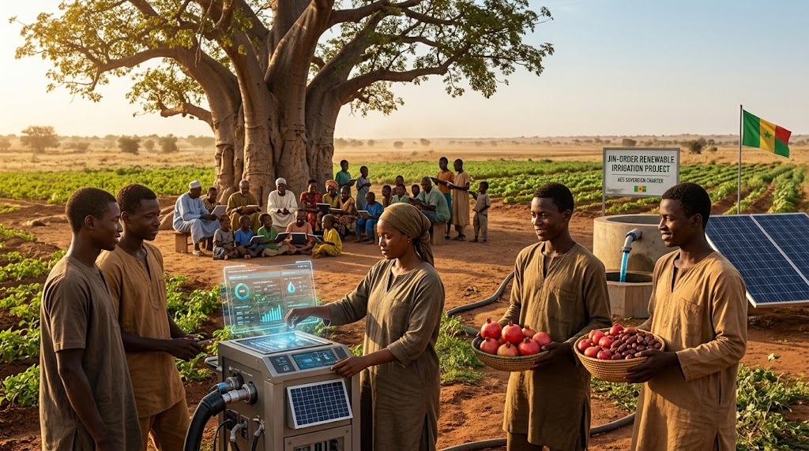  
*図3.2-F: 太陽光揚水ポンプとホログラム診断端末による農民主導のスマート水管理*

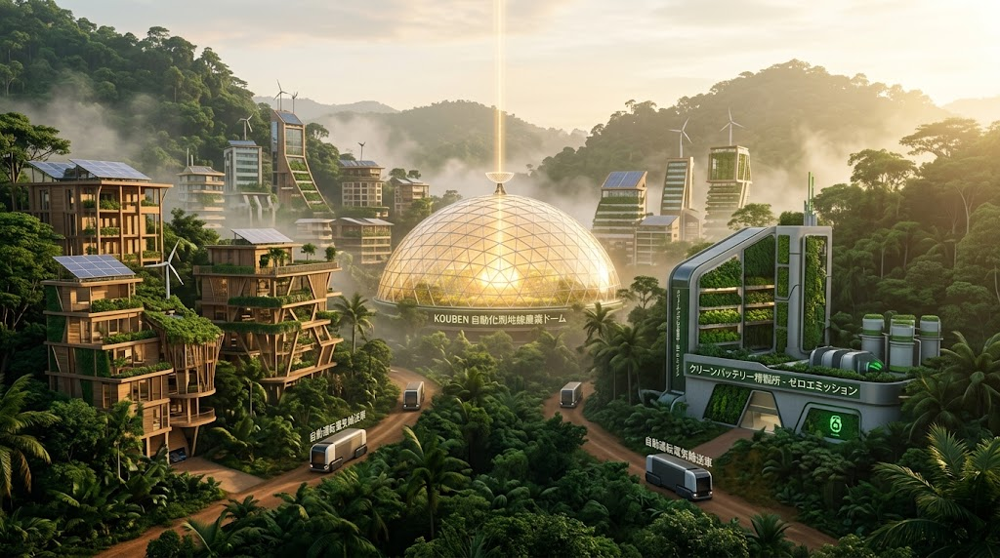  
*図3.2-G: 自動化高地農業ドーム、クリーンバッテリー精錬所、および自動運転EV輸送網*

---

### 3.3 Layer 2: 仁愛水和・人道主権カーネル層（Benevolent Commons Kernel）
技術の果実を生活者・社会的弱者へ不可逆的に還元する統治規範層。

### 1. 「Nobody Thirsts / Nobody Starves」プロトコル
* いかなる債務不履行、軍事的封鎖、または政治的分断が生じても、1人1日最低50Lの清浄水と基礎カロリー供給の遮断をシステムレベルで拒絶する。
* 鉱山開発跡地を緑のオアシスへと再生し、子どもたちの生存と安全な生活環境を完全回復する。

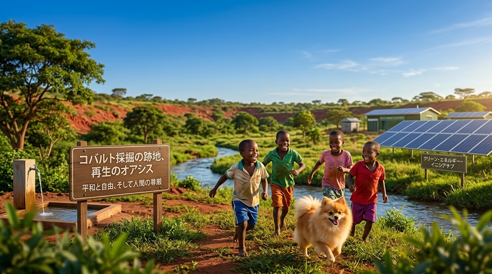  
*図3.3-A: かつての過酷な採掘跡地に清流を取り戻し、平和と尊厳を回復した「再生のオアシス」*

### 2. シスターフッド・アライアンス（DRCモデル）
* 鉱山・水資源の管理権を現地の母親たちによる「JIN-ORDER フェアトレード協同組合」へ移管する。
* 児童労働を完全に無力化・追放し、子どもたちにデジタル端末とソーラー学習環境を無償提供する。

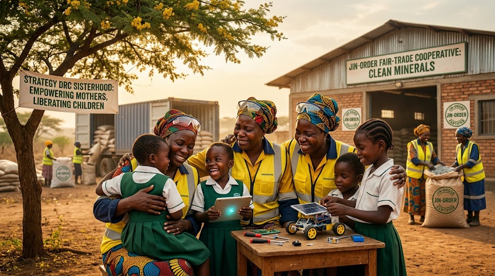  
*図3.3-B: 母親たちの主権回復（Empowering Mothers）と子どもたちの解放（Liberating Children）*

### 3. Pome 資源裏付け金融プロトコル
* コバルト、穀物ユニット（GU: 145.2 GU/ton）、肥料ユニット（FU: 78.9 FU/bag）を実物資産として分散台帳上でリアルタイムにトークン化する。
* 利息を伴う国際金融搾取を遮断し、太陽光水浄化システムや地域診療所建設に対する「無利子マイクログラント（資金調達）」を直結させる。

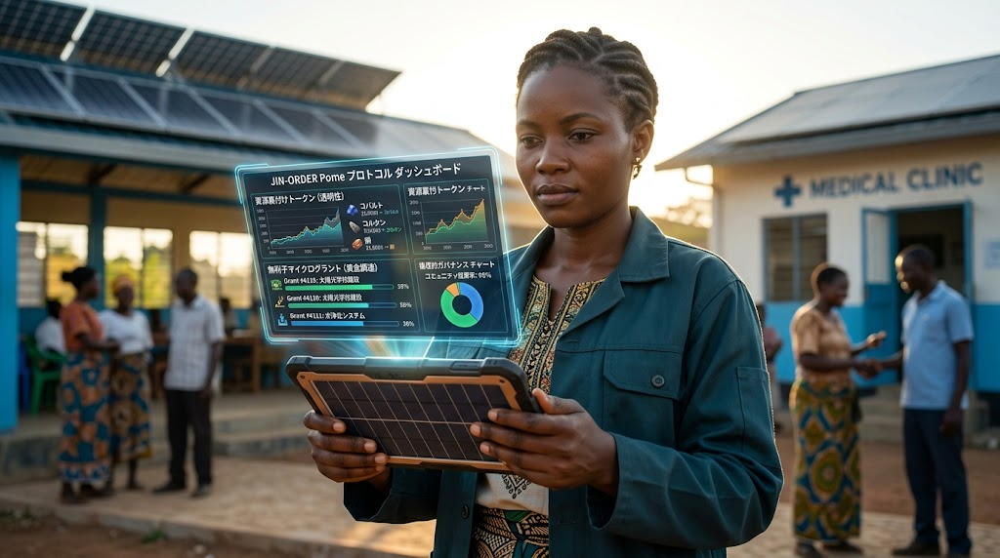  
*図3.3-C: 資源裏付けトークン透明性、無利子マイクログラント調達、および倫理的ガバナンス表示*

### 4. 六聖叡智教育法（Six Sacred Wisdom Pedagogy）
* 【学びの完全解放】【食と心の黄金律】【世界を旅する教室】【未来を創る道（技術・医療・農業・デザイン）】【生涯現役と郷愁】を包括する。
* 難民キャンプやオアシスで育った若者がエンジニアや医師となり、故郷を自立したオアシス都市へと再建する循環を保証する。

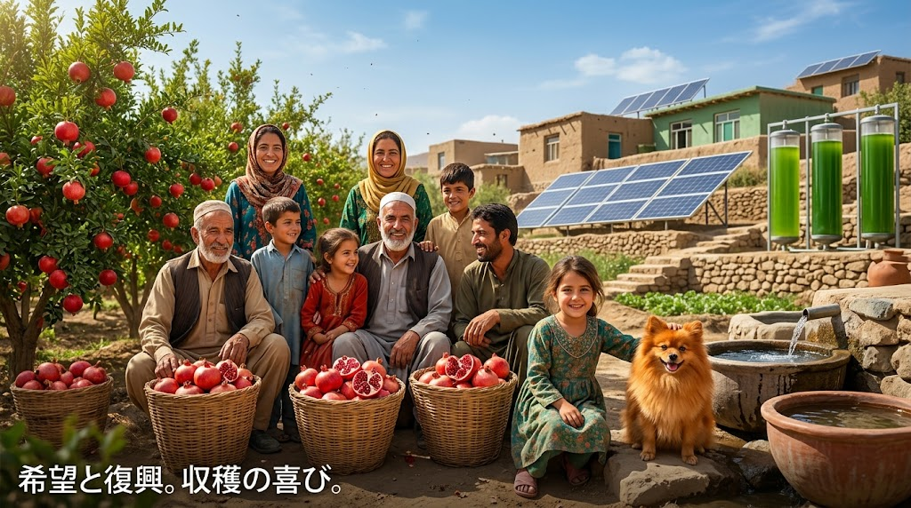  
*図3.3-D: ザクロの豊かな実り、太陽光パネル、微細藻類バイオリアクターと、笑顔を取り戻した家族*

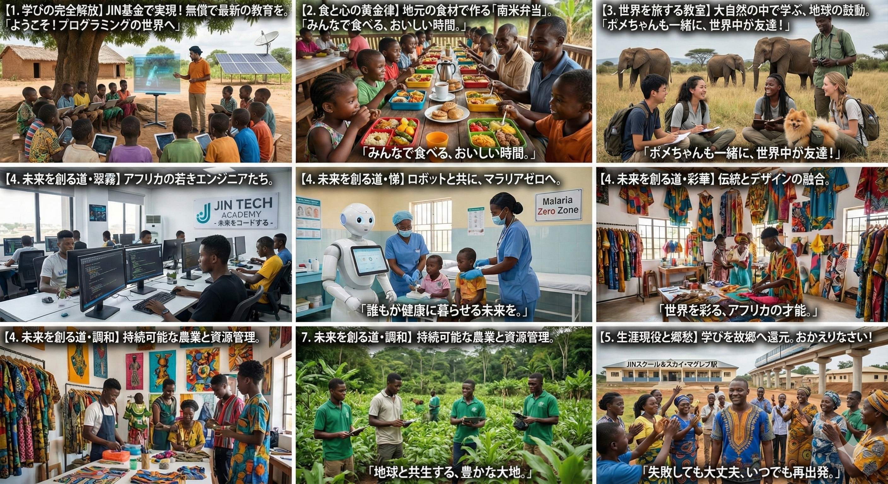  
*図3.3-E: JIN基金による無償プログラミング教育、食の黄金律、ロボット医療から郷土還元までの全教育体系*

---

## 4. 自立循環圏 展開・復興シーケンス（Oasis Reclamation Sequence）
荒廃地・紛争被災地における自立居住圏の迅速立ち上げモデル：

```コード スニペット
stateDiagram-v2
    [*] --> Phase0_Deployment: 移動式プラント・太陽光ユニット空中投下
    Phase0_Deployment --> Phase1_Hydration: 量子水濾過・カナート直結運転
    state Phase1_Hydration {
        [*] --> Water_Purification: 1L/s 超高純度飲料水供給
        Water_Purification --> MABR_Activation: 生活排水閉鎖循環系の起動
    }
    Phase1_Hydration --> Phase2_Civil3D: 現地砂・尾鉱のブロック化 & 3D自動積層
    state Phase2_Civil3D {
        [*] --> CSEB_Pressing: 砂漠砂高強度ブロック成形
        CSEB_Pressing --> Robotic_Printing: シェルター・学校・水路の自律建設
    }
    Phase2_Civil3D --> Phase3_Soil_Food: 肥料シールド解放 & 菌根菌オアシス農園
    Phase3_Soil_Food --> Phase4_Sovereign_Cell: Pome経済 & シスターフッド自立統治
    Phase4_Sovereign_Cell --> [*]: 完全閉鎖循環型「不沈オアシス」の確立
```
---

1. **フェーズ0（即時降下）：** ハイブリッド飛行船により、コンテナ型CSEB精製機と量子フィルターを現場へ搬入する。    
2. **フェーズ1（生命水和）：** 既存井戸・泥水河川・カナートに量子モジュールを接続し、即日無菌飲料水を確保する。   
3. **フェーズ2（大地造成）：** 現地砂をブロック化し、ロボット3Dプリンターで強固なシェルター群を建設する。     
4. **フェーズ3（土壌覚醒）：** バイオ炭と菌根菌で砂地を肥沃化し、ザクロ・小麦・デーツの収穫基盤を構築する。   
5. **フェーズ4（主権確立）：** Pomeダッシュボードを起動し、女性主導の協同組合による無利子経済と学校教育を稼働する。  
   
---

## 5. 憲章条文（Codified Articles）

本仕様書の内容は、『JIN_FRONTIER_LAW.md（開拓地特別法）』の第VI章として法制化される。

* **第15条（生命水源の共有地性と最低給水権 / Nobody Thirsts）**  
  すべての河川、地下水脈、カナート、および雨水捕集系は全人類の共有地（コモンズ）であり、いかなる国家・巨大資本による私的独占および兵糧攻めを禁ずる。<br>
  いかなる封鎖下でも生命維持用水は無条件提供されなければならない。  

* **第16条（大地の骨材化と現地居住権）**  
  未利用の砂漠砂、放棄鉱山の尾鉱は現地の共有建材財産として定義される。<br>
  外部からの資材搬入を口実とした立ち退き命令は無効であり、現地素材を用いた自律3D建設による居住権は不可侵である。  

* **第17条（土壌生命圏と種子主権の保護）**  
  化学肥料・遺伝子組み換え種子を用いた市場独占は排除され、菌根菌による土壌リン解放技術および在来種子ヴォルトは無償公開コモンズとして防護される。  

* **第18条（母性主権と児童労働の完全無効化）**  
  重要鉱物および一次産品の採掘・精錬権益は、現地の母性協同組合および地域コミュニティへ還元されなければならない。<br>
  児童労働によって得られた鉱物資源は国際JIN台帳において取引が自動遮断される。  

---

## 6. ロードマップと配備基準（2026–2030）

* **2026–2027:** アフガニスタン再生オアシス谷、チャド湖盆地、およびコンゴ（DRC）実証地区における量子水濾過・CSEB砂精製コンテナの先行配備完了。
* **2028–2029:** MABR水処理・汚泥バイオガス発電・サバティエ合成のワンパッケージ規格化と、3Dプリンター自動建設メッシュの広域展開。
* **2030:** 外部補給ゼロ下での10万人規模オアシス居住区完全閉鎖循環実験の成功、およびグローバルサウス全域へのオープンソース技術供与完了。  

---
*Document Authenticated by JIN-ORDER Global Architecture Registry.*
