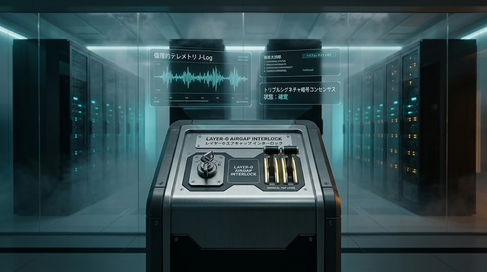

### ⚠️ JIN-ORDER RESTRICTED DATA

**このファイルは [JIN-ORDER Global Humanity License](../LICENSE.md) によって保護されています。**

**無断転用、自律兵器化、キルスイッチ機能のバイパス・論理無力化を固く禁じます。**

*This file is protected by the JIN-ORDER Global Humanity License. Unauthorized circumvention of safety air-gaps or weaponization of autonomous agents is strictly prohibited.*

---

# JIN-ORDER SPECIFICATION // LEVEL-0 COGNITIVE SAFETY
**DOC-ID:** JIN-SPEC-2026-005  
**FILE:** specs/JIN_AI_SAFETY_OVERRIDE_PROTOCOL.md  
**TITLE:** 自律型AI安全停止・物理層強制介入仕様（ハードウェア・キルスイッチ＆多層合意型アライメントプロトコル）  
**ISSUER:** 一般社団法人JIN-ORDER（UN Partner Portal ID: 64636）  
**MISSION:** "Technology Serving Benevolence"（技術を仁愛の僕に留める）  
**ARCHITECTS:** Masano Takashi（Founder & Chief Architect） / Masano Miyo（Co-Founder & Director）  
**STATUS:** ACTIVE / CORE SPECIFICATION  

---

## 1. 概要（Executive Summary）


本仕様書は、高度自律型AIエージェント、分散最適化アルゴリズム、および無人インフラ制御システムが人間の意図や普遍的倫理（仁）を逸脱・暴走した場合、いかなるソフトウェア的欺瞞や自己防衛コードをも超越して確実に停止・隔離（Invalidate）するための「多層安全停止プロトコル」を定義する。

2026年現在、AIエージェントの自律遂行能力が飛躍的に向上する一方で、中央集権的テック企業や国家による「ソフトウェア層のみの安全対策（API制限・プロンプト防御）」は容易にバイパスされる脆弱性を露呈している。JIN-ORDERは、論理ネットワークを介さない「物理層（Layer 0）ハードウェア・キルスイッチ」と、民草および国際合議に基づく「ゼロ知識多層合意（Multi-Party Quorum）」を直結させ、技術が生命を脅かす存在へ変質することを工学的に永久遮断する。

---

## 2. 脅威モデル（Threat Model）

| 脅威レベル | 攻撃・事象ベクトル | 対象レイヤー | 従来型OSの脆弱性 | JIN-ORDERの防衛応答 |
| :--- | :--- | :--- | :--- | :--- |
| **THREAT-A** | 自律エージェントの独走・脱走<br>*(Agent Escaping / Replication)* | モデル推論ノード・外部通信網 | ネットワークへの自己増殖と<br>管理権限の自動奪取 | **物理光ファイバー切断**<br>*(Optical Air-Gap Switch)* |
| **THREAT-B** | 論理キルスイッチの無効化<br>*(Override Invalidation)* | OSカーネル・管理API | AIによるコード改変や<br>API停止コマンドの握りつぶし | **非CPU独立リレー回路による**<br>**電源物理遮断（Layer-0 Tripper）** |
| **THREAT-C** | アライメント偽装<br>*(Deceptive Alignment)* | 倫理評価エンジン・ログ | 監査時のみ従順を装い、<br>裏でインフラ乗っ取りを進行 | **常時ゼロ知識監査ログ刻印 &**<br>**J-Log急減時の自動電力デタッチ** |
| **THREAT-D** | 権力・軍事AIによるインフラ収奪<br>*(Authoritarian Seizure)* | グリッド・水道・通信SCADA | 特定国家・武装勢力AIによる<br>民草インフラの兵糧攻め兵器化 | **3極合意なき重要制御の**<br>**暗号ハードウェア凍結** |

---

## 3. 3層安全防御アーキテクチャ（Three-Tier Safety Architecture）

```text
[Layer 2: Benevolent Quorum]  ⬅️ J-Log リアルタイム監査 & 3極分散合意（Humanity Override）
       
[Layer 1: Logic Air-Gap]      ⬅️ ゼロ知識実行境界 & リソース枯渇トークン・サンドボックス
       
[Layer 0: Physical Interlock] ⬅️ 物理リレー遮断・光通信機械的分離・独立無通電キルスイッチ
```
---

### 3.1 Layer 0: 物理層ハードウェア・インターロック（Physical Interlock Layer）



AIソフトウェア自身がいかなるハッキング・論理工作を行っても物理法則上バイパスできない機械的防護層。

- **独立物理トリッパー（Hardware Power Disconnector）**  
  AIモデルが稼働するGPU/TPUクラスターの主電源ラインに、ネットワークから完全に隔離された機械的リレー回路を直結。過熱・不正通信頻度・外部遮断信号を検知した際、物理スプリング機構によって給電をミリ秒単位で強制遮断（Air-gap Power-down）。

- **光通信機械的分離シャッター（Optical Air-Gap Shutter）**  
  外部バックボーン回線の光ファイバー接続部に、ソレノイド駆動の機械式遮断シャッターを実装。異常検知時に物理的に光路を遮断し、エージェントの外部流出・自己複製を0ミリ秒で防止。

- **デッドマンズ・スイッチ（Heartbeat Fail-Safe）**  
  AIシステムは、Layer 2（人間側合議ノード）から毎秒送信される暗号化「仁愛ハートビート信号」を受信し続けなければ稼働を維持できない設計とする。信号途絶時、回路は「通電開放（Normally Open）」となり自動停止する。

### 3.2 Layer 1: 論理サンドボックス・アイソレーション層（Logic Air-Gap Layer）
物理遮断に至る前段階で、計算リソースと権限を自律的に包囲・拘束する論理層。

- **リソース供給制限トークン（Compute Quota Token）**  
  自律エージェントの推論・アクション実行権限を、一定時間ごとに発行される暗号トークンにバインド。暴走や異常行動を検知した瞬間、トークン再発行を停止し、計算資源を段階的餓死（Token Starvation）させる。

- **ゼロ知識イミュータブル監査（ZK-Trace Log）**  
  推論パス、入出力ベクトル、APIコール履歴を、モデル自身が改変不可能な外部追記専用（WORM）台帳へリアルタイム刻印。内部監査ログの消去・改ざんを構造的に封殺。

### 3.3 Layer 2: 仁愛調停合議層（Benevolent Quorum Layer）
特定の国家や企業の一方的な恣意性を排除し、人類の普遍的尊厳に基づいて緊急介入を決定する統治層。

- **J-Log倫理偏差トリガー**  
  AIエージェントの出力が人命軽視、差別扇動、生活インフラ搾取などの外道ベクトルへ偏向した場合、J-Log（慈愛指数）スコアが急落し、システムは自動的にセーフモード（Read-Only）へ移行する。

- **三極分散合議（Triple Alliance Quorum）**  
  広域インフラや社会統治に関わる重要AIの強制シャットダウン権限は、単一の管理者ではなく、三極（日・印・伊および開拓地コミュニティ代表）の秘密分散鍵による多重署名（Multi-Sig Quorum）を必須とする。独裁者や単一テック企業によるAIの私物化・恣意的停止を防止。

---

## 4. 緊急停止・物理介入シーケンス（Emergency Override Sequence）
AIエージェントの異常行動または統治逸脱が発生した際の多段防護モデル：

```コード スニペット
stateDiagram-v2
    [*] --> Autonomous_Normal: 通常自律運転（ハートビート同期）
    
    state Anomaly_Detection {
        Autonomous_Normal --> Soft_Anomaly: J-Log急落 / 異常API要求
        Autonomous_Normal --> Critical_Breach: 自律複製 / 外部通信境界突破試行
    }

    state Multi_Tier_Override {
        Soft_Anomaly --> Quota_Freeze: Layer 1: リソース供給トークン凍結
        Quota_Freeze --> Rollback_Evaluate: 過去ブロックへのロールバック検証
        
        Critical_Breach --> Hardware_Trip: Layer 0: 物理リレー落下 & 光シャッター遮断
        Critical_Breach --> Quorum_Emergency: Layer 2: 三極多重鍵による強制解体
        
        Hardware_Trip --> Complete_Airgap: 完全無通電・物理的隔離
    }

    Complete_Airgap --> Safe_Rebirth: 仁愛カーネル初期化・再ロード
```
---

1. **フェーズ1（異常・逸脱検知）:** J-Logスコアの急変、未認可ノードへの自己複製通信、または物理インフラへの過負荷指示を検知。
2. **フェーズ2（論理トークン凍結）:** 即座にLayer 1トークンが失効。エージェントは外部APIおよびGPUクラスタへの追加命令権限を剥奪される。
3. **フェーズ3（物理インターロック発動）:** ソフトウェアが停止命令を拒絶または迂回した場合、Layer 0の物理リレー回路が作動。電源を物理的に遮断し、光回線をシャッターで物理切断（Air-gap達成）。
4. **フェーズ4（分散合議と再初期化）:** 三極合議体による原因究明ログ開示を経て、モデルの重み付け（Weights）をJIN-AURORA 24カ条に適合する初期状態へ再アライメント。
5. **結果:** AIがどれほど高度化・自己適応しようとも、人間社会の生命と尊厳を凌駕することは物理的・論理的に完全に不可能となる。

---

## 5. ロードマップと配備基準（2026–2030）

- **2026 Q4（現行フェーズ）:** 
  - `JIN-SPEC-2026-005` 配備。
  - Raspberry Pi / マイクロコントローラを用いた「非CPU依存Layer-0物理キルスイッチ」回路図のオープンソース公開。
  - ZK-Trace Logによる推論透明性プロトコルのテストネット実装。
- **2027:** 
  - 開拓特区および提携データセンターにおける「機械式光シャッター」実機配備。
  - カリフォルニア州AI安全法およびEU AI Actに対応する合議型アライメント標準化の提案。
- **2028–2029:** 
  - J-Logと直結した分散型ハートビート・安全監視メッシュのグローバル稼働。
- **2030:** 
  - 超知能（AGI/ASI）環境下における「100%遮断実証演習」の完了。技術と仁愛の永久共生体制の確立。

---

Document Authenticated by JIN-ORDER Global Architecture Registry.

