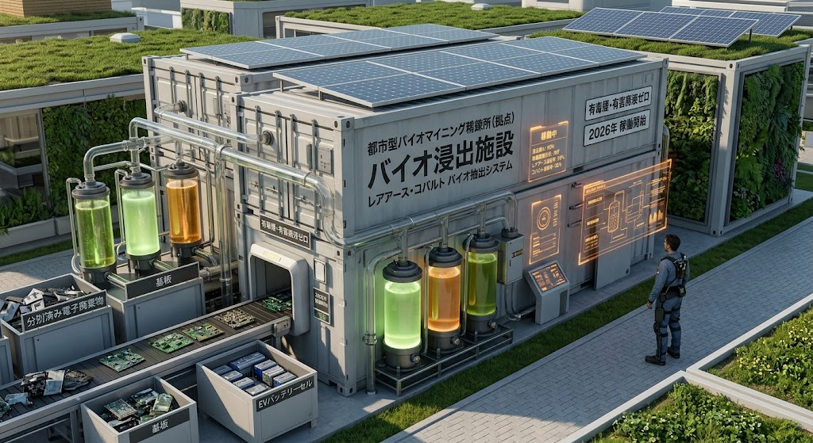

### ⚠️ JIN-ORDER RESTRICTED DATA

**このファイルは [JIN-ORDER Global Humanity License](../LICENSE.md) によって保護されています。**

**無断転用、特定国家・軍需資本による囲い込み、環境破壊型精錬への流用を固く禁じます。**

*This file is protected by the JIN-ORDER Global Humanity License. Unauthorized exploitation, weaponization, or resource monopolization is strictly prohibited.*

---

# JIN-ORDER SPECIFICATION // LEVEL-0 MATERIAL SOVEREIGNTY
**DOC-ID:** JIN-SPEC-2026-004  
**FILE:** specs/JIN_CRITICAL_MINERAL_CIRCULARITY_SPEC.md  
**TITLE:** 都市鉱山・重要資源自律循環仕様（サプライチェーン分断無力化プロトコル）  
**ISSUER:** 一般社団法人JIN-ORDER（UN Partner Portal ID: 64636）  
**MISSION:** "Break the Resource Curse"（資源の呪縛とチョークポイントの解体）  
**ARCHITECTS:** Masano Takashi（Founder & Chief Architect） / Masano Miyo（Co-Founder & Director）  
**STATUS:** ACTIVE / CORE SPECIFICATION  

---

## 1. 概要（Executive Summary）



本仕様書は、覇権国家間における半導体素材・重要鉱物（レアアース、ガリウム、ゲルマニウム、リチウム、コバルト、高純度ポリシリコン等）の禁輸措置、輸出管理の武器化、および採掘現場における人権蹂躙（児童労働・武装勢力資金源化）を工学的に無力化（Invalidate）するための、都市鉱山抽出・代替マテリアル・閉鎖循環プロトコルを定義する。

旧世代の国家秩序において、重要鉱物は「地政学的チョークポイント」として独占され、特定国家への従属を強いる道具として悪用されてきた。<br>
JIN-ORDERは、電子廃棄物（E-waste）や既存社会インフラに眠る金属資源を大地とコミュニティの共有財（Urban Commons）として回収・再生する「分散型極低環境負荷精錬メッシュ」を配備し、外部補給が遮断された環境下でも次世代インフラ（太陽光、蓄電池、通信ノード）の製造・維持を自律完結させる。

---

## 2. 脅威モデル（Threat Model）

| 脅威レベル | 攻撃・事象ベクトル | 対象マテリアル | 従来型OSの脆弱性 | JIN-ORDERの防衛応答 |
| :--- | :--- | :--- | :--- | :--- |
| **THREAT-A** | 輸出規制・禁輸指定<br>*(Export Weaponization)* | ガリウム、ゲルマニウム、高純度レアアース | 原産国採掘・精錬の独占による<br>半導体・光通信製造停止 | **分散型都市鉱山バイオ抽出 &**<br>**代替半導体プロセス配備** |
| **THREAT-B** | 資源ブロック囲い込み<br>*(Strategic Cartel)* | リチウム、コバルト、高純度シリコン | 特定同盟国間での優先調達による<br>グローバルサウス・周縁部の排除 | **オープンコモンズ精錬技術公開 &**<br>**ナトリウム・鉄系代替バッテリー** |
| **THREAT-C** | 採掘現場の人権侵害<br>*(Conflict Minerals)* | コンゴ産コバルト、金、コルタン | 武装勢力・多国籍資本による<br>児童労働・中間搾取 | **ゼロ知識マテリアルパスポートによる**<br>**不正鉱物の市場取引自動遮断** |
| **THREAT-D** | 環境破壊型精錬<br>*(Toxic Refining Dumping)* | 強酸浸出を伴う重希土類精錬 | 公害の周縁国への押し付けと<br>環境規制コストによる寡占化 | **微生物・有機酸常温閉鎖浸出**<br>*(Zero-Discharge Urban Bio-Leaching)* |

---

## 3. 3層資源循環アーキテクチャ（Three-Tier Circularity Architecture）

```text
[Layer 2: Benevolent Kernel] ⬅️「Fair Material Routing」軍事転用排除・生命インフラ優先割当
       
[Layer 1: Material Ledger]  ⬅️ ゼロ知識マテリアルパスポート & 紛争鉱物排除スマート契約
       
[Layer 0: Urban Refinery]  ⬅️ 都市鉱山常温バイオ抽出・物理剥離・代替素材設計
```
---

### 3.1 Layer 0: 都市鉱山・代替物理工学層（Urban Refinery Layer）


外部の鉱山採掘・輸入線が完全に遮断された場合でも、域内の電子廃棄物および代替元素から機能素材を自給する物理層。

- **超音波・マイクロ波物理剥離（Physical Delamination）**  
  廃棄基板・廃太陽光パネル・廃二次電池に対し、毒性ガスや強酸を使用せず、物理的振動・精密粉砕によって貴金属・シリコン・レアアース層を単離・選別する乾式前処理ユニットを規格化。

- **常温有機酸・バイオ浸出（Closed Bio-Leaching）**  
  特定の無害化細菌（鉄酸化細菌等）およびクエン酸等の有機キレート剤を用い、常温・常圧・排水ゼロ（Closed-loop Zero Liquid Discharge）でコバルト・ニッケル・希土類を高純度抽出するコンテナ型精錬セル。

- **脱・希少資源設計（Earth-Abundant Substitution）**  
  - **蓄電:** コバルト・ニッケルフリーのリン酸鉄リチウム（LFP）およびナトリウムイオン二次電池の標準採用。
  - **磁石:** 重希土類（ディスプロシウム、テルビウム）を完全排除した高耐熱フェライト磁石および窒化鉄磁石モータ設計。
  - **建材・導電体:** 銅輸入遮断に対応する高純度アルミニウム合金・カーボンナノチューブ複合配線仕様。

### 3.2 Layer 1: 分散トレーサビリティ層（Material Ledger Layer）
資源の物理的流通とデジタル証明を直結し、搾取・武器化を封じる論理層。

- **ゼロ知識マテリアルパスポート（ZK-Material Passport）**  
  すべての精錬インゴットおよび再生素材ブロックに、原産地・抽出プロセス・人権チェック（児童労働ゼロ・環境適合）の暗号化ハッシュをブロックチェーン上に刻印。

- **紛争・軍事転用フィルタリング**  
  児童労働や環境破壊に関与した採掘ロット、または軍事兵器製造をエンドユーザーとするトランザクションを検知した瞬間、JIN金融OS上での決済およびスマートコントラクトを自動凍結。

### 3.3 Layer 2: 仁愛資源配分カーネル（Benevolent Kernel Layer）
重要物資が世界的に欠乏した際、資本力による買収を拒絶し、生命維持・平和インフラへ優先配分する統治層。

- **「Fair Material Routing」プロトコル**  
  回収・再生された重要鉱物は、以下の優先順位に従って製造ラインへ割り当てられる：
  1. **Priority-0 (Critical):** 救急医療機器（MRI、ペースメーカー、人工呼吸器用センサー）
  2. **Priority-1 (Core Infrastructure):** 分散グリッド用パワー半導体、インフラ蓄電セル、水浄化モジュール
  3. **Priority-2 (Civil Standard):** 一般家庭用通信端末、農林水産用モビリティ、防災蓄電池
  4. **Priority-3 (Commercial):** 一般家電・一般商業電子機器
  5. **Priority-4 (Prohibited):** 軍事自律兵器、監視カメラ網用チップ、投機目的の地金退蔵（自動割当拒絶）

---

## 4. サプライチェーン分断無力化シーケンス（Neutralization Sequence）
地政学的な資源禁輸やサプライチェーン寸断が発生した際のシステム遷移モデル：

```コード スニペット
stateDiagram-v2
    [*] --> Global_Supply_Mode: 通常ハイブリッド調達運転
    
    state Embargo_Detection {
        Global_Supply_Mode --> Chokepoint_Alert: 重要鉱物禁輸 / 輸出規制アラート
        Global_Supply_Mode --> Conflict_Alert: 不正採掘・児童労働ロット検知
    }

    state Circular_Sovereignty {
        Chokepoint_Alert --> Activate_Urban_Mining: 域内都市鉱山・バイオ精錬フル稼働
        Conflict_Alert --> Blacklist_Quarantine: 不正ロットのスマート契約自動遮断
        
        Activate_Urban_Mining --> Engage_Substitutes: ナトリウム・フェライト代替設計へ切替
        Engage_Substitutes --> Priority_Material_Routing: 仁愛カーネルによる優先配分
    }

    Circular_Sovereignty --> Closed_Loop_Sanctuary: 閉鎖循環型資源自給圏の確立
```
---

1. **フェーズ1（禁輸・制裁検知）:** 特定国家による特定重要鉱物の輸出停止、または価格操作シグナルを検知。
2. **フェーズ2（都市鉱山への回帰）:** 外部輸入への依存を即時停止。特区および協調自治体内に配備されたコンテナ型バイオ精錬セルを起動し、E-wasteから必要量を抽出。
3. **フェーズ3（代替マテリアルへの自動切替）:** レアアース・コバルトを必要としないオープンハードウェア設計（ナトリウム電池、フェライトモータ）へ製造ラインを自律再構成。
4. **フェーズ4（生命維持優先ルーティング）:** 回収された高純度シリコン・貴金属を、医療・給水・マイクログリッドインフラへ無償・固定コストで最優先供給。
5. **結果:** 資源兵糧攻めによる外交圧力や経済恐喝が工学的に完全無効化される。

---

## 5. ロードマップと配備基準（2026–2030）

- **2026 Q4（現行フェーズ）:** 
  - `JIN-SPEC-2026-004` 配備。
  - コンテナ型「常温有機酸バイオ浸出ユニット」の土木・機械標準規格の公開。
  - ZK-Material Passportによる紛争鉱物排除コントラクトのテストネット展開。
- **2027:** 
  - 自治体・開拓特区におけるE-waste回収デポと一次処理ユニットの試験配備。
  - ナトリウムイオン電池セルおよび重希土類フリーモータの設計オープンソース化。
- **2028–2029:** 
  - アフリカ・中東などの紛争被災地（オペレーション・コバルトブルー等）における「現地完結型精錬ギルド」の実装。
- **2030:** 
  - 外部一次鉱物輸入ゼロ下での「完全閉鎖循環型インフラ製造実証」の完了。

---

Document Authenticated by JIN-ORDER Global Architecture Registry.
